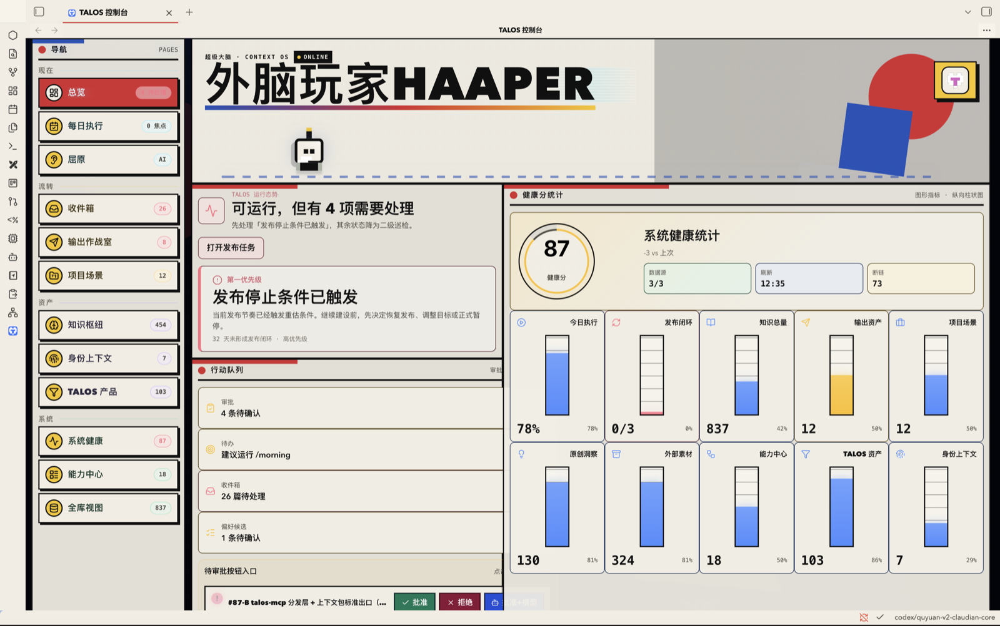
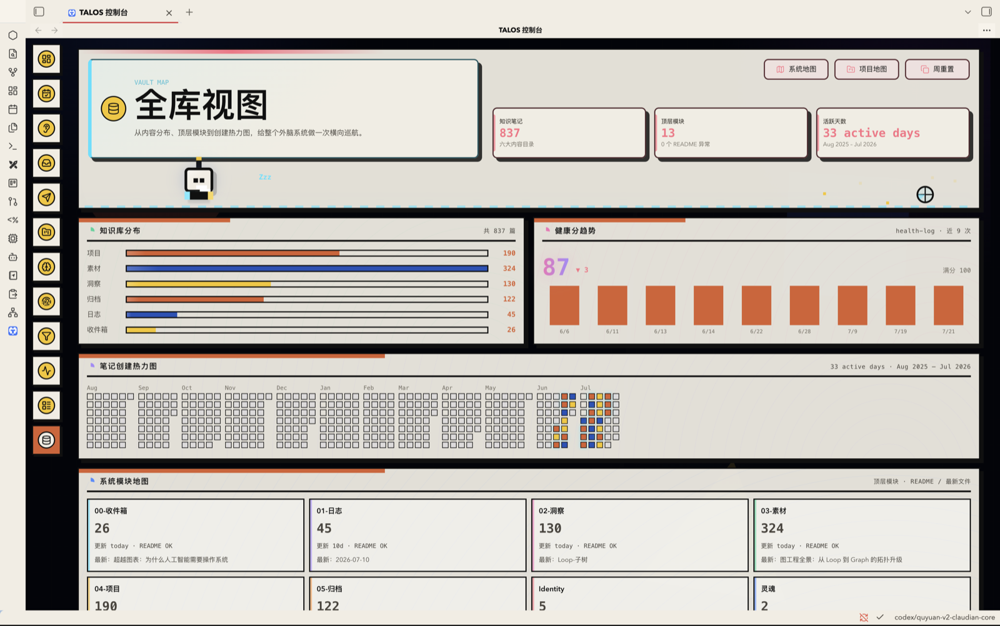
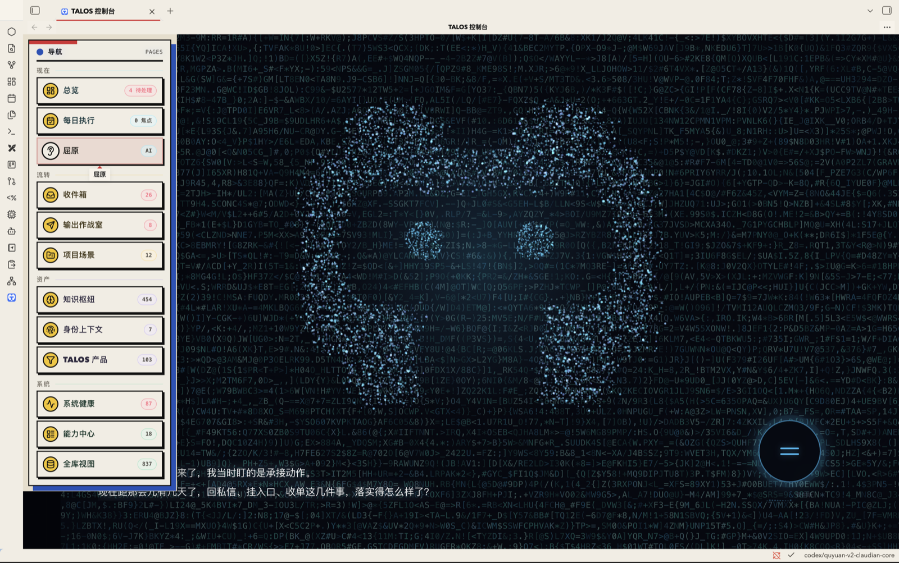

# TALOS 控制台插件

> **TALOS** 是「超级大脑系统」的原生 Obsidian 控制台：一个视图里扫全库、实时统计、把每个系统模块的运行态势与 TALOS 发布作战室呈现出来，并内嵌「屈原」AI Agent 工作台（全双工语音 + 审批治理 + 多 Provider Agent 工作台）。

*总览：行动层级总览——主判断 → 指标矩阵 → 状态卡 → 焦点下钻*

*全库视图：知识库分布、健康趋势、笔记热力图与 13 模块地图*

*屈原：AI Agent 语音工作台，球形粒子 Logo + 流式对话与朗读*

## ✨ 功能速览

- **原生控制台**：基于 Obsidian ItemView，打开即实时计算全库统计，事件驱动自动刷新，取代手写脚本与 iframe 仪表盘。
- **行动层级总览**：主判断 → 2×2 结果指标 → 二级状态小卡 → 焦点/建议下钻。
- **10 个业务页**：每日执行、输出、TALOS、收件箱、健康、项目、知识、身份、能力、全库，统一模块首屏 + 真实状态采集。
- **能力中心**：命令 / Agents / 工作流 三标签切换，读取 `.claude/commands`、`.claude/agents`、`.agents/skills`，点击复制调用。
- **审批治理**：待审批项支持「批准 / 拒绝 / 批准+模型」写回决策并刷新队列，区分「审批已记录」与「实际变更已执行」。
- **屈原 AI Agent**：开口或打字 → `@anthropic-ai/claude-agent-sdk` 流式跑全库 agentic 任务 → 流式分句朗读；带完整 Claudian 式权限审批 UI。
- **语音 I/O**：STT（WebSpeech / 本地 ASR）+ 三引擎 TTS（system / elevenlabs / aliyun），流式边生成边朗读。
- **七套主题**：Aurora 原版、Nebula 深色宇宙、Animal Island 小岛、Macintosh 知识工作站、数据流·动态终端、柔光浮雕·Neumorphism、几何现代主义·Bauhaus。
- **视觉系统**：屈原球形粒子 Logo 语音工作区（6727 粒子）、总览像素机器人巡航、全库笔记热力图、13 模块地图、健康趋势图。
- **发布作战室**：G1–G3 + PUB-W 发布闭环看板。

## 📦 安装

本插件为专有商业许可，不进入 Obsidian 社区商店，请通过 GitHub Release 手动安装。

### 前置要求

- Obsidian **≥ 1.8.0**，桌面端（macOS / Windows / Linux，`isDesktopOnly`）。
- 屈原 Agent 能力需要本机已安装 `claude` CLI（[Claude Agent SDK](https://www.npmjs.com/package/@anthropic-ai/claude-agent-sdk) 会调用），并配置 `ANTHROPIC_*` 环境变量；或使用 BYOK 自带 API Key。
- 可选：语音 TTS（ElevenLabs / 阿里云）与本地 ASR 对应的密钥与运行时。

### 手动安装

1. 从本仓库最新的 [Releases](https://github.com/WAINAO-Haaper/talos-plugin/releases) 下载 `main.js`、`manifest.json`、`styles.css`、`MaShanZheng-Regular.ttf`、`TALOS-Favicon-64-v1.png`。
2. 在你的 vault 下创建目录 `<vault>/.obsidian/plugins/talos/`，把上述文件放入。
3. Obsidian → 设置 → 社区插件，找到「TALOS」并启用。
4. 在插件设置页选择视觉风格、配置 `claude` CLI 路径 / 模型 / 语音引擎。

## 🚀 快速上手

1. 启用插件后，点击左侧栏的 TALOS 图标打开控制台。
2. 在「总览」查看运行判断与指标矩阵，左侧导航切到各业务页。
3. 打开「屈原」进入语音工作台：开口说话或输入指令，Agent 流式执行全库任务并朗读回复；首次工具调用会弹出权限审批卡。
4. 命令面板（`Ctrl/Cmd+P`）搜索「TALOS」可发现刷新统计、生成诊断报告、打开完整工作台等命令。
5. 命令面板选择「TALOS：全库问答」可通过 canonical `talos-ask` 入口调用同一套检索、Provider、隐私门和审批治理。

## 🎨 外观与主题

复刻极光玻璃态风格：近黑深色底（`--bg #03040a`）+ 极淡网格、玻璃卡（backdrop-blur + 彩虹顶边 + 每卡独立强调色）、渐变 Hero/时钟文字、发光 section 圆点、shimmer 进度条，并支持 `prefers-reduced-motion` 降级。

设置页「视觉风格」提供七套主题：`Aurora 原版（默认）`、`Nebula 深色宇宙稿`、`Animal Island 小岛主题`、`Macintosh 知识工作站`、`数据流 · 动态终端`、`柔光浮雕 · Neumorphism`、`几何现代主义 · Bauhaus`。后三套参考 `NovusGFX/retro-design-system` 的 32/37/42 号 MIT 主题，将视觉语言映射到 TALOS 的真实导航、指标卡、图表、详情页和屈原面板，并为十个页面设置独立配色。数据流限制为 20 列合成层动画（移动端 10 列），且移除原参考中的电影专有文案；三套均支持 `prefers-reduced-motion`。

Animal Island 主题参考 `guokaigdg/animal-island-ui` 的温暖羊皮纸底、薄荷青主色、棕色文字、波点墙纸、胶囊按钮、圆润卡片和游戏按压反馈；因源仓库许可证为 CC BY-NC 4.0，本插件未复制其源码、字体或图片素材，只在本地 CSS 中做原创风格迁移。Macintosh 主题参考 `sakofchit/system.css` 的 Classic Mac/System 6 视觉语言（黑白窗口、条纹标题栏、凸起/按下按钮、单色桌面纹理），源仓库 MIT；本插件未引入其字体、图标或源码文件。

**多页结构**：左侧导航持续保留；TALOS 系统控制台 Hero 仅在「总览」显示，屈原保留独立语音工作台，其余业务子页使用统一模块首屏（模块图标、运行说明、关键状态、快捷动作）后进入本页内容区。点导航按钮切页，数据刷新一次缓存、切页即时渲染。

## 🧭 仪表盘与导航信息架构

总览采用「缩小主判断 → 2×2 结果指标 → 二级状态小卡 → 焦点/建议下钻区」的行动层级。数据来自任务流、发布作战室、健康记录、审批池、收件箱与偏好候选池；首屏不再把单个模块横向拉满，而是把运行判断和第一优先级收成左侧中等宽度指挥卡，今日执行、发布闭环、系统准备度、数据新鲜度以右侧指标矩阵承接；待处理、焦点、收件箱和巡检降为小状态卡。桌面保留左侧完整导航，680px 以下改为横向导航轨道。

子页继续承载 **能力中心**、知识库分布、健康趋势、13 模块地图、全库笔记热力图与 TALOS 发布作战室（G1-G3 + PUB-W）。10 个业务页顶部统一提供模块首屏，并沿用总览单模块优化方案：左侧主说明缩成纸面指挥块，标题卡用模块身份色做浅底、左侧色条、图标和英文小标题强调；右侧真实统计固定为 2×2 纸面矩阵，动作按钮统一收在下方；标题卡、统计卡和动作按钮统一具备强化鼠标悬停反馈，只有真实可点的卡片显示手型。屈原页不共用该组件，避免干扰语音工作台布局。

### 导航信息架构

导航不直接复刻目录树，而是把真实库结构压成四个工作域；每项显示来自运行时采集器的真实状态数字：

| 工作域 | 常驻入口 | 对应真实结构 |
|---|---|---|
| 现在 | 总览、每日执行、屈原 | `tasks.md`、工作记忆、Agent 交互 |
| 流转 | 收件箱、输出作战室、项目场景 | `00-收件箱/`、`输出/`、`04-项目/` |
| 资产 | 知识枢纽、身份上下文、TALOS 产品 | `02-洞察/`、`03-素材/`、`Identity/`、`灵魂/`、TALOS 七分区 |
| 系统 | 系统健康、能力中心、全库视图 | `System/`、命令/Agents/Skills、六大内容目录 |

`01-日志/`、`05-归档/`、`模板/`、`自动化/`、`配置/`、`template/`、`attachments/` 和 `Excalidraw/` 不单独占常驻入口：它们在「全库视图」「系统健康」或「能力中心」中按职责聚合。

**每日执行舱**：原生读取 `System/working-memory/tasks.md` 焦点区与 `done_when`，呈现今日唯一胜利条件、双深度块、六段固定时间轨道、执行铁轨、抗选择瘫痪协议、周轮值与真实文件入口；"开工 / /morning / 收工 / /memory" 按钮点击复制调用。

## 🤖 屈原 AI Agent

### 屈原 v2 · Claudian 技术融合（#73-B）

目标不是把 TALOS 改名成 Claudian，也不是运行时依赖外部 Claudian 插件，而是把其成熟的通用 Agent 工作台内核固化进屈原。TALOS 仍是唯一主品牌，屈原是 TALOS 内的 Agent 模块。

当前融合基线为 Claudian 2.0.25（固定提交见 `src/quyuan/upstream.ts`），已接入多 Provider 工作台、多标签会话、恢复/分叉/压缩/回退、工具调用与 diff、MCP、Skills、子智能体、上下文附件和行内编辑。TALOS 在外层追加三项不可替代能力：

- **人格先于工作台**：启动必须全文加载 `灵魂/PERSONA.md`、`灵魂/persona-memory.md` 与 `Identity/CONTEXT.md`；缺失即关闭屈原 v2，不降级成无人格通用助手。
- **治理先于写入**：写操作走 TALOS 审批策略；Markdown 行内编辑会先读取目标目录 `_README.md`，`PROFILE.md`、`Identity/`、`灵魂/` 保留硬闸。
- **TALOS 差异层**：沿用现有语音总开关与三种 TTS，屈原 v2 的流式回复可边生成边朗读；旧侧栏和 STT 暂留作回滚/迁移层。

默认入口：Obsidian 左侧栏只保留一个 TALOS 图标，打开统一控制台；控制台左侧导航「屈原」、动态 Logo 和底部命令条进入语音工作区。完整 v2 工作台与旧版回滚入口保留在命令面板。TALOS 已内嵌 Claudian 工作台能力，不依赖外部 Claudian 插件；如用户仍保留独立插件，它继续使用自己的 `.claudian/` 会话，TALOS 内嵌工作台使用 `.talos/quyuan/`，两者不混写。

### WP7 升级迁移

从 0.4.x 升级时，插件使用独立 migration schema 分步保留 TALOS 设置、Claudian tabs、文字/语音会话、语音与 ASR/TTS 开关、自定义目录映射和旧命令入口。明文 Provider key 只有在写入并读回验证 Obsidian SecretStorage 后才从插件设置删除；SecretStorage 不可用或启动中断时保持 migration v0，下次启动从已完成步骤继续。本地旧命令 `open-quyuan-v2`、`open-jarvis` 和旧 Claudian view type 至少保留一个版本周期。

### 屈原 Agentic（B 方案 · v1 回滚层）

导航第二项「屈原」。全双工 agentic：**开口/打字 → claude-agent-sdk 流式跑全库 agentic 任务（读写/命令/多步）→ 流式分句朗读**。先前以对齐 Claudian 为目标的自研实现，现保留为安全回滚层。

> **命名（2026-06-28）**：原显示名「贾维斯/JARVIS」已统一改为「屈原」，与库内 `灵魂/PERSONA` 人格层对应。仅改面向用户的显示文案与导航徽标；内部标识符（`jarvis` 页 key、`JarvisEngine`/`JarvisAgentPanel` 类名、`src/jarvis/` 路径、`jv-` CSS 前缀）保持不变以免编译断裂。

- **引擎**（`src/jarvis/engine.ts`）：`@anthropic-ai/claude-agent-sdk` 的 `query()`，流式输入 → 单会话多轮、可 `interrupt()`/`setPermissionMode()`。`pathToClaudeCodeExecutable` 指向本机 claude（设置留空则登录 shell `command -v claude` 自动探测；**必传**）。`env` 用登录 shell 捞回（GUI 启动的 Obsidian 拿不到 `~/.zshrc` 的 `ANTHROPIC_*`）。`settingSources:["user","project","local"]` → 加载库的 CLAUDE.md/.claude。
- **权限审批 UI**（Claudian 式）：`canUseTool` 把每次工具调用挂起 → 审批卡片（允许 / 允许并记住 / 拒绝）。面板顶部「权限」下拉可切 `default` / `acceptEdits` / `plan`(只读) / `bypassPermissions`(危险)。
- **语音 I/O**（`src/jarvis/voiceio.ts`）：`StreamTts` 边收文本增量边按句切分入队朗读——首句生成完即开口；复用三引擎 system/elevenlabs/aliyun。`MicStt` 用 WebSpeech，开口说完 final 结果自动发送。
- **设置**：`jarvisClaudeBin` / `jarvisModel` / `jarvisPermissionMode` / `jarvisSttEngine` / `jarvisSttLang`，TTS 用既有 `ttsEngine`/嗓音/语速/音调项。
- **包体**：v1 曾为 851K；屈原 v2 融合完整工作台后当前生产包约 2.93MB，换取真实的会话编排、MCP、子智能体、diff 与多 Provider 能力。

### 多通道执行链路对齐 Claudian

详细技术方案见 [`docs/multi-channel-execution.md`](docs/multi-channel-execution.md)（2026-06-28，P0–P5 全部落地）。

## 🛠️ 开发与构建

`npm install` → `npm run licenses:generate`（仅依赖变化时）→ `npm run build`。

构建会先执行许可证审计，清单过期或商业元数据回退时直接失败。商业交付包必须同时包含 `main.js`、`manifest.json`、`styles.css`、`LICENSE`、`THIRD-PARTY-NOTICES.md`、`THIRD-PARTY-LICENSES.txt`、`MaShanZheng-Regular.ttf`、`MaShanZheng-OFL.txt`、`TALOS-Favicon-64-v1.png`。

常用脚本：

| 命令 | 作用 |
|---|---|
| `npm run dev` | 生成 styles + esbuild 开发构建 |
| `npm run build` | 许可证审计 → typecheck → styles → esbuild production |
| `npm run typecheck` | TypeScript 类型检查 |
| `npm test` | vitest 测试套件 |
| `npm run test:quyuan` / `test:approval-actions` / `test:approval-executor` | 各模块自测内核 |
| `npm run licenses:check` | 第三方许可证清单审计 |
| `npm run lint` | eslint |

## 📁 源码结构

- `src/main.ts` 入口；`src/view.ts` ItemView + 全部 render；`src/settings.ts` 设置页
- `src/quyuan/` **屈原 v2 融合层**：人格启动闸、能力契约、TALOS 治理适配、Claudian 2.0.25 固定快照与上游说明；第三方实现保留 MIT 溯源，面向用户统一使用 TALOS / 屈原命名
- `src/quyuan/voice-panel.ts` + `voice-character-stage.ts` + `voice-particle-field.ts` + `voice-driver.ts` **屈原 Antigravity 球形粒子 Logo 语音工作区**：五组圆角实体模块构成实心窄边 T-Shield，6247 主体球形粒子 + 480 圆眼粒子共 6727，休眠/唤醒/聆听/识别/思考/回答各状态动效
- `src/data/stats.ts` 全库统计；`src/data/talos.ts` 发布作战室；`src/data/navigation.ts` 高频导航页数据采集；`src/actions.ts` 动作 + 模态框
- `src/approval-actions.ts` / `approval-executor.ts` 待审批的纯文本变换内核与授权执行器（配 `approval-*.selftest.mjs` 沙盘自测）
- `src/jarvis/` **屈原 v1 回滚层**：保留原自研多通道 Agent、会话、语音与权限实现；迁移期不删除
- `src/voice.ts` 旧屈原一期（已停用，保留不删）
- `styles.css` 七套完整主题（scope 在 `.talos-console`）；`styles.talos.css` / `styles.quyuan-shell.css` 分域样式
- `prototype/` 设计稿原型与视觉回验页面（详见 `docs/design-qa.md`）；`theme-preview.html` 主题本地回验

## 🧪 测试

- 单元测试：`npm test`（vitest，如 `tests/stream-render-scheduler.test.ts`）
- 自测内核：`test:quyuan`、`test:approval-actions`、`test:approval-executor`（`*.selftest.mjs`，沙盘文本验证）
- 所有 PR 经 CI 自动跑 typecheck + 全量测试 + 许可证审计 + 生产构建（见 `.github/workflows/ci.yml`）

## 📜 许可与第三方

- **`LICENSE`**：TALOS 自有代码的**专有商业许可**；不覆盖 Claudian 与其他第三方材料。客户使用、席位、期限和再分发权须由单独商业协议/EULA 授予。
- **`THIRD-PARTY-NOTICES.md`**：Claudian MIT、Claude Agent SDK 商业条款、BYOK 边界和直接运行时依赖摘要。
- **`THIRD-PARTY-LICENSES.txt`**：由 `third-party-licenses.mjs` 根据 lockfile 自动生成的生产依赖完整许可证包（当前覆盖 109 个已安装生产包）。
- **`MaShanZheng-Regular.ttf` + `MaShanZheng-OFL.txt`**：屈原语音主标题使用的本地毛笔字体与 SIL OFL 1.1 许可证；随插件部署，离线可用。
- **`TALOS-Favicon-64-v1.png`**：TALOS Modular T-Shield 定稿图标。**`TALOS-Mascot-Character-Transparent-v1.png`**：动画人物概念资产与回滚参考。

## 🗂️ 历史背景与统计口径

展开：取代了什么 / 统计口径校验（面向维护者）

### 取代了什么（已完成取代）

| | 旧（已退役/备份） | 新（本插件） |
|---|---|---|
| 统计 | `refresh-dashboard.py` 手动跑，写 STATS 块 | 打开即实时算，事件驱动自动刷新 |
| 载体 | `dashboard.html` + `超级大脑仪表盘.md` iframe | 原生 ItemView |
| 操作 | 只展示 | 刷新统计 / 发布回填 / 新建 / Deep Research / 命令路由 / Lint |

> 旧方案退役进度（2026-06-28）：根目录 `超级大脑仪表盘.md` 已删除；`dashboard.html` + python 暂留为回退备份。

### 统计口径（与 refresh-dashboard.py 一致，已校验）

知识笔记 = 六大内容目录（04/03/02/05/01/00）.md，排除 `_README`、`/node_modules/`、`/客户交付物/`、`/交付包/`、`/talos-system-promo`。校验值：合计 741（项目143/素材314/洞察115/归档120/日志40/收件箱9）。

待审批读 `pending-approvals.md` 当前待审批段、偏好候选读 `candidates.md` 待确认段、健康分读 `health-log.md` EVAL_HISTORY、焦点读 `System/.../tasks.md`、发布作战室读 `04-项目/TALOS系统/tasks.md`。

Agent 协作规则见同目录 `AGENTS.md`。完整变更历史见 [`CHANGELOG.md`](CHANGELOG.md)。

