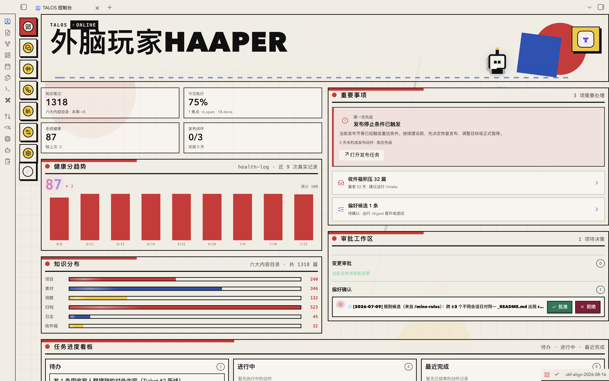
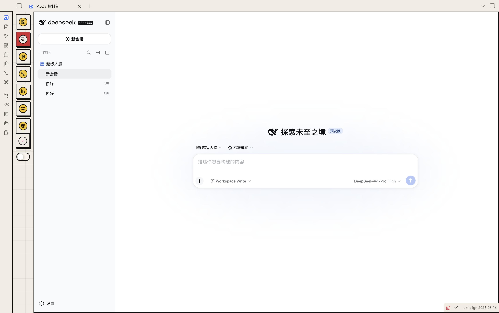
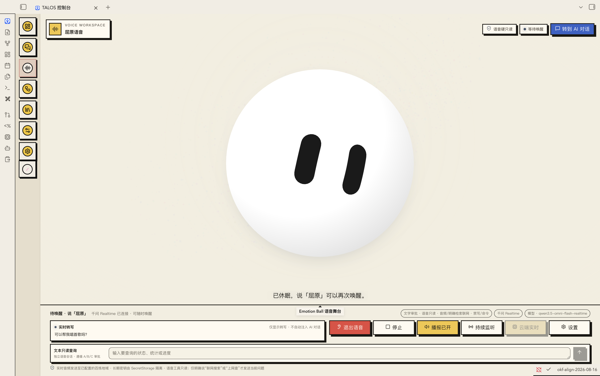
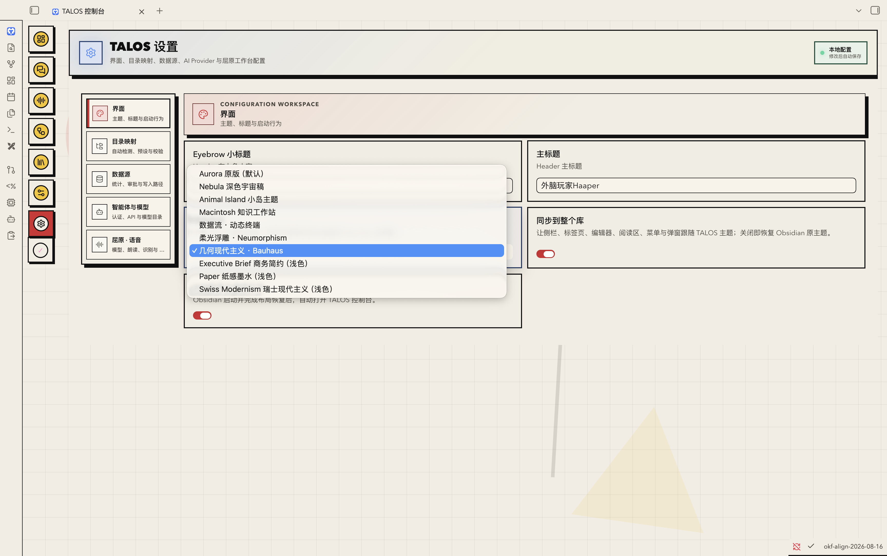
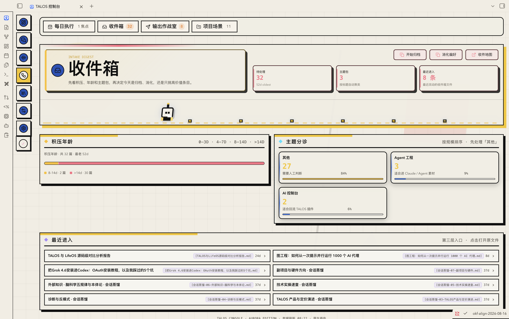
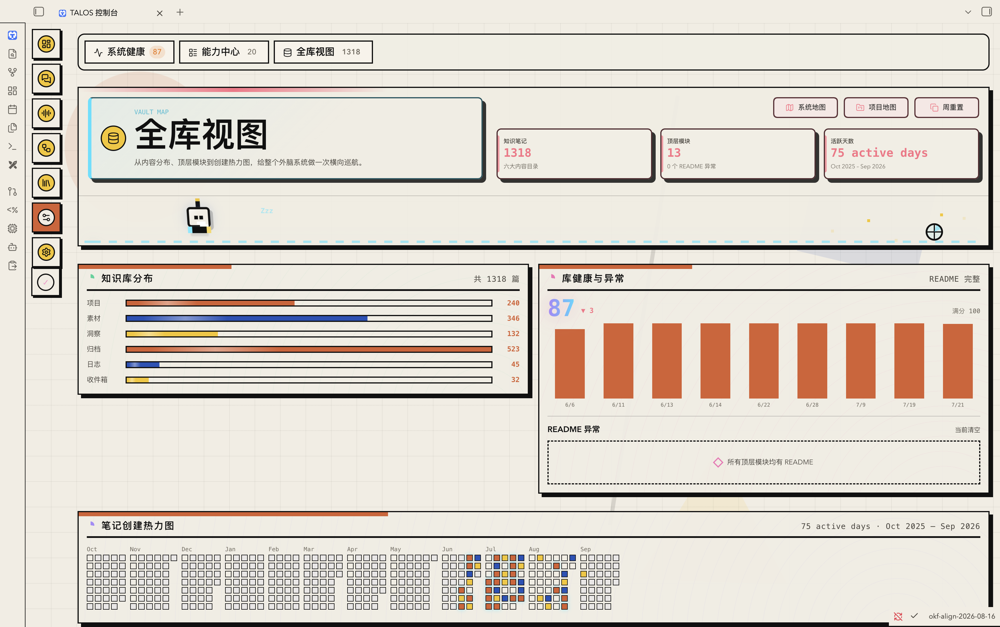

# TALOS for Obsidian


> 把 Obsidian Vault 变成可观察、可治理、可执行的个人 AI 工作台。

TALOS 是一个桌面端 Obsidian 原生插件。它把散落在 Vault 里的任务、项目、知识、收件箱、健康记录和发布状态汇总为一个实时控制台，并把多智能体对话、审批治理和「屈原」实时语音放进同一套工作流。

## 界面预览

以下为控制台实际运行界面与 v0.4.5 TalosBall 0.3.0 动画预览。点击图片可查看原始尺寸。

| 指挥总览 · Bauhaus | AI 对话 · DeepSeek Harness |
|---|---|
| [](docs/screenshots/v0.4.1/overview-bauhaus.png) | [](docs/screenshots/v0.4.1/ai-chat-deepseek-harness.png) |
| 屈原语音 · TalosBall 0.3.0 | 设置 · 主题与模型 |
| [](docs/screenshots/v0.4.4/voice-workspace-talosball.png) | [](docs/screenshots/v0.4.1/settings-themes.png) |
| 收件箱治理 | 全库视图 |
| [](docs/screenshots/v0.4.1/inbox-governance.png) | [](docs/screenshots/v0.4.1/vault-overview.png) |

## 产品全景

| 工作区 | 你可以做什么 |
|---|---|
| **指挥总览** | 查看今日焦点、知识规模、系统健康、发布闭环、重要事项、审批队列和任务进度。 |
| **AI 对话** | 在 TALOS 原生多会话工作台与嵌入式 DeepSeek Harness 中切换项目、模型和会话。 |
| **屈原语音** | 使用 Qwen Realtime 进行唤醒、连续对话、实时转写与语音回复；语音工具默认只读。 |
| **收件箱治理** | 按积压年龄、主题聚类和最近进入情况整理内容，并进入归档、消化或地图视图。 |
| **全库视图** | 查看内容分布、README 完整性、库健康、活跃天数、项目地图和笔记热力图。 |
| **统一设置** | 配置界面、目录映射、数据源、智能体、模型、SecretStorage 和语音服务。 |

## 核心能力

- **实时 Vault 控制台**：基于 Obsidian `ItemView` 原生渲染；打开即统计，文件变化后事件驱动刷新。
- **行动与治理**：将焦点、待办、审批、偏好候选、发布门和健康信号放在同一个决策面板中。
- **多智能体工作台**：支持 Claude、Codex、OhMyPi、本机登录态和兼容 Anthropic/OpenAI 协议的 Direct API Provider；提供会话恢复、分叉、压缩、附件、工具调用、diff、MCP、Skills 和子智能体界面。
- **DeepSeek Harness**：在控制台内打开隔离的 Harness 工作区，保留项目与多会话导航，并由插件管理本地进程和健康状态。
- **屈原 Qwen Realtime 语音**：支持语音唤醒、持续监听、实时转写、音频回复、文本只读查询和 TALOS Ball 状态舞台。
- **只读语音工具**：语音可查询 Vault 状态、统计和进度；不会暴露写库或命令执行工具。只有明确说出「联网搜索」或「上网查」时，才会发送当前问题进行联网检索。
- **十套视觉主题**：Aurora、Nebula、Animal Island、Macintosh、数据流、柔光浮雕、Bauhaus、Executive Brief、Paper 和 Swiss Modernism；可选择只应用于控制台或同步到整个 Vault。
- **安全默认值**：API 密钥只写入 Obsidian SecretStorage；审计记录脱敏；缺少可验证 OS 沙箱时，写入型 Execute 会失败关闭。
- **无损升级**：迁移按 schema 分步执行；首次启动可补齐缺失的 TALOS 基线人格与注册文件，但不会覆盖已有内容。

## 平台状态

v0.4.5 使用同一套跨平台代码，但不同系统的安全能力并不伪装成完全一致。

| 平台 | 当前状态 | AI 执行边界 |
|---|---|---|
| **macOS** | 主要支持平台 | 本机 Claude / Codex / OhMyPi 可在可验证的 macOS Seatbelt 沙箱内运行；沙箱不可用时 Execute 失败关闭。 |
| **Windows 10/11 x64** | v0.4.5 已加入部署与兼容支持 | 推荐使用 SecretStorage 中配置的 Direct API Provider；当前为 **Plan-only**，不会启动本机 CLI 或执行工具。`.cmd` / `.bat` 仅用于安全发现，路径包含 shell 元字符时拒绝启动。 |
| **其他桌面系统** | 非当前交付重点 | 没有可验证 OS 沙箱时，本机智能体 Execute 失败关闭。 |

### 目标硬件

- macOS：Apple M1 Air、8 GB 内存、SSD 或更高配置。
- Windows：4 核 x64 CPU、8 GB 内存、SSD，性能目标对齐 M1 Air 级别设备。
- Obsidian **≥ 1.11.4**。

当前自动化回归、构建和跨平台边界测试已通过；M1 Air 与对应 Windows 真机的长会话、语音和大库性能矩阵仍在持续验收。因此以上是支持目标，不是尚未完成真机矩阵前的性能保证。

### 发布状态说明

本仓库的插件版本发布不改变 TALOS 2.x 的统一产品发布权威。当前统一产品门仍为 `formal_release_allowed=false`；只有 G1–G7 全部通过并取得单独授权后，才能宣称 TALOS 产品正式放行。PUB-W 属于内容发布工作流，不是产品发布门，也不能替代 G1–G7。

## 安装

TALOS 使用专有商业许可，不进入 Obsidian 社区插件商店。请从本仓库 [Releases](https://github.com/WAINAO-Haaper/talos-plugin/releases) 安装。v0.4.5 候选已嵌入 TalosBall 0.3.0；v0.4.1 不再建议用于商业分发。

### 按系统下载安装包

| 操作系统 | 安装包名称 |
|---|---|
| **macOS** | `TALOS-v0.4.5-macOS.zip` |
| **Windows 10/11 x64** | `TALOS-v0.4.5-Windows.zip` |

两个压缩包使用同一套 v0.4.5 插件载荷，文件名用于帮助用户选择对应系统的安装入口。

1. 从最新 Release 下载与你的操作系统对应的 ZIP。
2. 解压后将其中的 `talos` 文件夹放到 `<你的 Vault>/.obsidian/plugins/`。
3. 重启 Obsidian，打开「设置 → 社区插件」，启用 TALOS。
4. 进入「TALOS 设置 → 智能体与模型」，配置本机运行时或把 API 密钥保存到 SecretStorage，并选择 Provider 与模型。

### 手动安装（macOS / Windows）

把 Release 中的以下文件放入 `<你的 Vault>/.obsidian/plugins/talos/`：

- `main.js`
- `manifest.json`
- `styles.css`
- `LICENSE`
- `THIRD-PARTY-NOTICES.md`
- `THIRD-PARTY-LICENSES.txt`
- `MaShanZheng-Regular.ttf`
- `MaShanZheng-OFL.txt`
- `TALOS-Favicon-64-v1.png`

升级前建议备份 Vault。覆盖插件文件时不要删除或替换 `data.json`、`.talos/` 和已有的人格、身份文件。

## 快速上手

1. 点击 Obsidian 左侧栏的 TALOS 图标，打开统一控制台。
2. 在「总览」确认今日焦点、系统健康、审批队列和待处理事项。
3. 在「AI 对话」选择工作区、Provider、模型与工作流。Windows 用户优先选择 Direct API 的 Plan 模式。
4. 在「屈原语音」配置百炼地域、Qwen Realtime 模型和音色；说出唤醒词后开始连续对话。
5. 在「收件箱」处理积压，在「全库视图」检查内容分布、README 完整性和创建热力图。
6. 在「设置」选择主题、映射目录，并决定是否把 TALOS 主题同步到整个 Vault。

## 安全与隐私

- 云端 API 密钥、Token 和语音长期凭据只保存在 Obsidian SecretStorage，不写入普通插件配置。
- 本机 CLI 使用现有登录态，SecretStorage 值不会进入模型上下文、日志、诊断报告或发布包。
- Direct API 通道只提供文本规划，不暴露本机工具。
- 本机执行必须通过 OS 级沙箱；无法验证隔离时拒绝 Execute。
- 文件写入受 Vault 边界、受保护路径、审批策略和审计记录共同约束。
- 实时语音只注册有限的只读 Vault 工具；联网搜索需要明确口令。

更完整的执行链路见 [`docs/multi-channel-execution.md`](docs/multi-channel-execution.md)，升级与回滚验收见 [`docs/qa/wp7-upgrade-rollback.md`](docs/qa/wp7-upgrade-rollback.md)。

## 开发与验证

```bash
npm install
npm test
npm run typecheck
npm run lint
npm run licenses:check
npm run build
```

生产构建会执行许可证审计、TypeScript 检查、样式合并和 esbuild 打包。商业交付包必须包含安装章节列出的 9 个文件。

### 源码结构

- `src/main.ts`：插件生命周期、命令、工作台与 Provider 装配。
- `src/view.ts`：控制台 ItemView、导航和业务页面。
- `src/agent-workbench/`：多智能体会话、运行时适配、审批、安全、存储和 UI。
- `src/harness/`：DeepSeek Harness 嵌入、进程管理和健康检查。
- `src/quyuan/`：人格、Qwen Realtime 语音、只读工具和 TALOS Ball 舞台。
- `src/data/`：全库统计、导航、项目与发布状态采集。
- `tests/`：跨平台、安全、迁移、语音、Provider 和 UI 契约回归。

## 许可

> Copyright © 2026 外脑玩家 Haaper. All rights reserved. 未经书面许可，不得复制、修改、重新打包、分发、转售、白标、托管或用于商业服务。

- `LICENSE`：TALOS 自有代码的专有商业许可；客户使用、席位、期限和再分发权由单独协议授予。
- `THIRD-PARTY-NOTICES.md`：第三方组件、视觉参考和商业条款摘要。
- `THIRD-PARTY-LICENSES.txt`：由 lockfile 自动生成的生产依赖许可证包。
- `MaShanZheng-Regular.ttf` / `MaShanZheng-OFL.txt`：屈原标题字体及 SIL OFL 1.1 许可证。

- **TALOS Ball**：语音中心视觉使用 TalosBall 0.3.0；Plugin 保留语音状态适配与生命周期集成，几何、32 态和动效遵循固定等价基线；来源与发布门见 [TALOS Ball provenance](docs/talos-ball-provenance.md)。

完整变更记录见 [`CHANGELOG.md`](CHANGELOG.md)。
